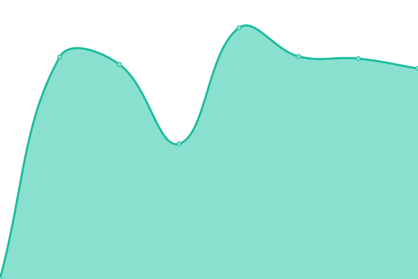

# [📈 Live Status](https://demo.upptime.js.org): <!--live status--> **🟧 Partial outage**

This repository contains the open-source uptime monitor and status page for [Upptime](https://upptime.js.org), powered by [Upptime](https://github.com/upptime/upptime).

With [Upptime](https://upptime.js.org), you can get your own unlimited and free uptime monitor and status page, powered entirely by a GitHub repository. We use [Issues](https://github.com/upptime/upptime/issues) as incident reports, [Actions](https://github.com/Nugget2269/ubiquitous-octo-carnival/actions) as uptime monitors, and [Pages](https://demo.upptime.js.org) for the status page.

<!--start: status pages-->
<!-- This summary is generated by Upptime (https://github.com/upptime/upptime) -->
<!-- Do not edit this manually, your changes will be overwritten -->
<!-- prettier-ignore -->
| URL | Status | History | Response Time | Uptime |
| --- | ------ | ------- | ------------- | ------ |
|  [Mailcow](https://mail.grobecker.me) | 🟩 Up | [mailcow.yml](https://github.com/Nugget2269/ubiquitous-octo-carnival/commits/HEAD/history/mailcow.yml) | 

 803ms
     
 | 

<a href="https://Nugget2269.github.io/ubiquitous-octo-carnival/history/mailcow">85.79%</a>
    

|  [Hedgedoc](https://md.grobecker.me) | 🟩 Up | [hedgedoc.yml](https://github.com/Nugget2269/ubiquitous-octo-carnival/commits/HEAD/history/hedgedoc.yml) | 

 595ms
     
 | 

<a href="https://Nugget2269.github.io/ubiquitous-octo-carnival/history/hedgedoc">84.91%</a>
    

|  [Forgejo](https://git.grobecker.me) | 🟩 Up | [forgejo.yml](https://github.com/Nugget2269/ubiquitous-octo-carnival/commits/HEAD/history/forgejo.yml) | 

 633ms
     
 | 

<a href="https://Nugget2269.github.io/ubiquitous-octo-carnival/history/forgejo">84.91%</a>
    

|  [Seafile](https://files.grobecker.me) | 🟥 Down | [seafile.yml](https://github.com/Nugget2269/ubiquitous-octo-carnival/commits/HEAD/history/seafile.yml) | 

 705ms
     
 | 

<a href="https://Nugget2269.github.io/ubiquitous-octo-carnival/history/seafile">83.18%</a>
    

|  [ntfy](https://notify.grobecker.me) | 🟩 Up | [ntfy.yml](https://github.com/Nugget2269/ubiquitous-octo-carnival/commits/HEAD/history/ntfy.yml) | 

 477ms
     
 | 

<a href="https://Nugget2269.github.io/ubiquitous-octo-carnival/history/ntfy">84.91%</a>
    

|  [Bitwarden](https://vault.grobecker.me) | 🟩 Up | [bitwarden.yml](https://github.com/Nugget2269/ubiquitous-octo-carnival/commits/HEAD/history/bitwarden.yml) | 

 448ms
     
 | 

<a href="https://Nugget2269.github.io/ubiquitous-octo-carnival/history/bitwarden">84.91%</a>
    

|  [Linkwarden](https://links.grobecker.me) | 🟩 Up | [linkwarden.yml](https://github.com/Nugget2269/ubiquitous-octo-carnival/commits/HEAD/history/linkwarden.yml) | 

 1101ms
     
 | 

<a href="https://Nugget2269.github.io/ubiquitous-octo-carnival/history/linkwarden">85.07%</a>
    

|  [Firefly III](https://firefly.grobecker.me) | 🟩 Up | [firefly-iii.yml](https://github.com/Nugget2269/ubiquitous-octo-carnival/commits/HEAD/history/firefly-iii.yml) | 

 1110ms
     
 | 

<a href="https://Nugget2269.github.io/ubiquitous-octo-carnival/history/firefly-iii">85.03%</a>
    

|  [ArchiveBox](https://archive.grobecker.me) | 🟥 Down | [archive-box.yml](https://github.com/Nugget2269/ubiquitous-octo-carnival/commits/HEAD/history/archive-box.yml) | 

 959ms
     
 | 

<a href="https://Nugget2269.github.io/ubiquitous-octo-carnival/history/archive-box">79.54%</a>
    

|  [Dashy](https://home.grobecker.me/) | 🟩 Up | [dashy.yml](https://github.com/Nugget2269/ubiquitous-octo-carnival/commits/HEAD/history/dashy.yml) | 

 579ms
     
 | 

<a href="https://Nugget2269.github.io/ubiquitous-octo-carnival/history/dashy">84.92%</a>
    

<!--end: status pages-->

[**Visit our status website →**](https://demo.upptime.js.org)

## 📄 License

- Powered by: [Upptime](https://github.com/upptime/upptime)
- Code: [MIT](./LICENSE) © [Anand Chowdhary](https://anandchowdhary.com), supported by [Pabio](https://pabio.com)
- Data in the `./history` directory: [Open Database License](https://opendatacommons.org/licenses/odbl/1-0/)
